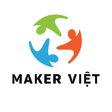

<div align="center">
  

  # Hướng dẫn Hệ thống (Developer)

  **NeoStopMotion v1.0** · BBStopMotion

  Tài liệu kỹ thuật cho dev/operator cài đặt, cấu hình, mở rộng app.
</div>

---

## 1. Tổng quan kiến trúc

```
┌────────────────────────────────────────────────────────────────┐
│                    UI LAYER (QML 6)                            │
│                                                                │
│  MainWindow.qml ─ StackView                                    │
│   ├ SplashScreen.qml         (logo BBStopMotion + branding)      │
│   ├ CapturePage.qml          (live preview + onion skin)       │
│   ├ ExportingPage.qml        (progress bar)                    │
│   └ SuccessPage.qml          (video loop + QR + share URL)     │
│                                                                │
│  Singletons: NeoConstants (design tokens) + AppState (state)   │
└──────────────────────┬─────────────────────────────────────────┘
                       │ context properties (appController, signalBusBridge, resourcesUrl)
┌──────────────────────▼─────────────────────────────────────────┐
│           APPLICATION LAYER (Python services)                  │
│                                                                │
│  AppController         SessionService      ExportService       │
│  (root facade,         (lifecycle:         (QThread:           │
│   exposed to QML)      session_*)          ffmpeg + upload)    │
└──────────────────────┬─────────────────────────────────────────┘
                       │ SignalBus (pyqtSignal hub)
┌──────────────────────▼─────────────────────────────────────────┐
│                CORE PROCESSING                                 │
│  CaptureEngine    UARTListener    FrameManager                 │
│  (cv2 + onion)    (pyserial)      (PNG + project.json)         │
│                                                                │
│  VideoExporter    CloudUploader   (qrcode local)               │
│  (ffmpeg)         (catbox.moe)                                 │
└──────────────────────┬─────────────────────────────────────────┘
                       │
┌──────────────────────▼─────────────────────────────────────────┐
│  HARDWARE / DATA                                               │
│  USB Webcam · ThingBot UART · ~/projects/session_*/            │
└────────────────────────────────────────────────────────────────┘
```

Chi tiết kiến trúc đầy đủ: xem [ARCHITECTURE.md](ARCHITECTURE.md).

## 2. Yêu cầu hệ thống

### Dev (macOS / Ubuntu desktop)

| Thành phần | Yêu cầu |
|---|---|
| Python | 3.10+ (3.11/3.12/3.13/3.14 OK) |
| ffmpeg | 5.x+ (libx264, libxlib) |
| Webcam | bất kỳ USB cam (nếu không có, app tự dùng SyntheticCaptureEngine) |
| ThingBot | tuỳ chọn — nếu không cắm thì keyboard fallback (Space/Z/Enter) |

### Production (NEO One)

| Thành phần | Yêu cầu |
|---|---|
| OS | Ubuntu 22.04 LTS / Armbian Bookworm (aarch64) |
| RAM | 2 GB tối thiểu |
| Storage | 500 MB trống cho app + ~50 MB / session |
| Display | HDMI 1280×720 trở lên (touchscreen tuỳ chọn) |
| Webcam | USB 2.0 720p+ (Logitech C270 hoặc tương đương) |
| ThingBot | Arduino Uno/ESP32 + 2 nút arcade + 2 LED + buzzer |

## 3. Cài đặt

### macOS dev

```bash
git clone https://github.com/makerviet/NeoStopMotion.git
cd NeoStopMotion
python3 -m venv .venv && source .venv/bin/activate
pip install -e .
brew install ffmpeg
make run         # camera permission popup lần đầu
```

### NEO One (Armbian/Ubuntu ARM64)

```bash
sudo bash deployment/install-armbian.sh
sudo systemctl enable --now neostopmotion
journalctl -u neostopmotion -f   # theo dõi log
```

(Chi tiết deployment: xem `deployment/install-armbian.sh` + plan task T6.1-T6.2.)

### Flash ThingBot firmware

Xem `firmware/thingbot_stopmotion/README.md` cho hướng dẫn nối dây + flash bằng PlatformIO hoặc Arduino IDE.

## 4. Cấu hình

3 lớp ưu tiên (cao thắng thấp):

1. **Built-in defaults**: `src/neo_stopmotion/config/defaults.toml`
2. **User config**: `~/.config/neostopmotion/config.toml`
3. **Environment variables** (override mọi thứ trên)

### File user config (ví dụ)

```toml
# ~/.config/neostopmotion/config.toml

[capture]
webcam_index = 0           # 0 = camera mặc định, 1 = thứ 2…
onion_opacity = 0.30       # 0 = không onion skin, 1 = chỉ thấy frame trước

[uart]
port = "auto"              # "auto" tự dò, hoặc "/dev/thingbot", "simulator"
baudrate = 115200

[export]
playback_fps = 10          # cảm giác stop motion cổ điển
min_frames = 5             # phải có ít nhất 5 frame mới enable nút TẠO PHIM

[storage]
projects_dir = "/home/maker/projects"

[ui]
fullscreen = true          # production: true; dev: false để có thể đóng cửa sổ
```

### Environment variables

| Biến | Giá trị | Tác dụng |
|---|---|---|
| `NEO_STOPMOTION_UART` | `auto` / `simulator` / `/dev/ttyUSB0` | Chọn UART backend |
| `NEO_STOPMOTION_CAPTURE` | `synthetic` | Bỏ qua webcam, dùng frame test pattern |
| `NEO_STOPMOTION_CLOUD` | `0` / `1` | Tắt/bật upload cloud (mặc định: bật) |
| `NEO_STOPMOTION_AUTOSHOOT` | số nguyên N | Tự bấm SHOOT N lần rồi quit (test headless) |
| `NEO_STOPMOTION_AUTOEXPORT` | `1` | Sau AUTOSHOOT tự kích EXPORT |
| `NEO_STOPMOTION_DEBUG` | `1` / `true` | Log level DEBUG (mặc định INFO) |
| `NEO_STOPMOTION_PROJECTS_DIR` | path | Override `[storage] projects_dir` |
| `NEO_STOPMOTION_WEBCAM_INDEX` | số nguyên | Override `[capture] webcam_index` |

### Logs

| Vị trí | Nội dung |
|---|---|
| stderr | Console log, format `HH:MM:SS LEVEL module \| message` |
| `~/.local/share/neostopmotion/logs/neostopmotion_YYYY-MM-DD.log` | File log, rotate 10MB, retention 7 ngày |

## 5. Luồng dữ liệu

### File system structure

```
~/projects/                                  (configurable: storage.projects_dir)
└── session_2026_05_10_193722/               (1 session = 1 phim)
    ├── frames/
    │   ├── frame_0001.png                   (atomic write: tmp → rename)
    │   ├── frame_0002.png                   (1280×720 PNG, RAW không có onion skin)
    │   └── ...
    ├── output.mp4                           (1280×720 H.264, watermark BBStopMotion)
    ├── output.gif                           (640×360 lanczos, watermark)
    ├── qr.png                               (QR code 360px trỏ tới shareUrl)
    └── project.json                         (SessionMeta serialized)
```

### project.json schema

```json
{
  "session_id": "2026_05_10_193722",
  "created_at": "2026-05-10T19:37:22.158-07:00",
  "frame_count": 8,
  "fps_playback": 10,
  "duration_seconds": 0.8,
  "title": "",
  "creator_name": "",
  "status": "completed",
  "exported": true,
  "mp4_path": "/home/maker/projects/session_*/output.mp4",
  "gif_path": "/home/maker/projects/session_*/output.gif",
  "qr_path": "/home/maker/projects/session_*/qr.png",
  "download_url": "https://files.catbox.moe/42s5nv.mp4"
}
```

### Cloud upload flow

```
[Frames PNG] ─→ ffmpeg MP4 + watermark ─→ output.mp4
                                              │
                                              ↓
                            CloudUploader.upload(output.mp4)
                                              │
                              ┌───────────────┴────────────────┐
                              ↓                                ↓
                  catbox.moe (primary)              0x0.st (fallback)
                  permanent, 200MB free             30-day temp
                              │                                │
                              └───────────────┬────────────────┘
                                              ↓
                                  https://files.catbox.moe/abc.mp4
                                              ↓
                              qrcode lib → qr.png (360px)
                                              ↓
                                    SuccessPage hiển thị
```

## 6. Trải nghiệm người dùng

### Phím tắt / nút

| Phím | Nút ThingBot | Hành động |
|---|---|---|
| `Space` | IO1 (xanh) | Chụp 1 frame; trên SuccessPage thì auto-reset + chụp frame 1 phim mới |
| `Z` | _(không có)_ | Xoá frame mới nhất (UNDO) |
| `Enter` | IO2 (đỏ) | Tạo phim từ tất cả frames đã chụp (cần ≥5 frame) |

### Page transitions

```
SplashScreen ─2s→ CapturePage ⇄ ExportingPage ─→ SuccessPage
                       ↑                            │
                       └──── reset_session() ───────┘
                            (Quay lại button HOẶC Space/IO1)
```

### Auto-reset behavior

Khi user bấm SHOOT (Space/IO1) trên **SuccessPage**, app:
1. Set `_post_export = False` trong `AppController`
2. Tạo session mới (`SessionService.reset()`)
3. Reset onion skin source (`CaptureEngine.reset()`)
4. Emit `session_reset` signal → QML chuyển về `CapturePage`
5. Capture frame đầu tiên ngay (không lỡ động tác của HS)

## 7. Mở rộng / customize

### Thay logo watermark

```bash
# Replace với logo riêng (giữ tỉ lệ vuông để watermark không méo)
cp /path/to/your_logo.png src/neo_stopmotion/resources/images/maker_viet_logo.png
```

Hoặc edit `app.py` đổi đường dẫn:

```python
watermark = Path("/path/to/custom_logo.png")
```

### Thay cloud uploader

`src/neo_stopmotion/core/cloud_uploader.py` có 2 service hard-code:
- `_upload_catbox()` — primary
- `_upload_0x0st()` — fallback

Thêm Google Drive / S3 / IPFS:
1. Viết method mới (vd `_upload_drive()`)
2. Thêm vào tuple trong `upload()`:

```python
for attempt_name, fn in (
    ("Google Drive", self._upload_drive),
    ("catbox.moe", self._upload_catbox),
    ("0x0.st", self._upload_0x0st),
):
    ...
```

### Thay color palette

Edit `src/neo_stopmotion/ui/qml/singletons/NeoConstants.qml`:

```qml
readonly property color primary:    "#FF7043"   // Coral
readonly property color secondary:  "#1565C0"   // Ocean Blue
// ...
```

Hot reload: kill app + chạy lại (QML không hỗ trợ live-reload trong PyQt6).

### Thay đổi watermark vị trí / kích thước

Trong `VideoExporter.__init__`:

```python
exporter = VideoExporter(
    watermark_path=Path("logo.png"),
    watermark_width=110,           # px (mặc định 110)
    watermark_opacity=0.85,        # 0..1
    watermark_margin=20,           # khoảng cách đến cạnh
)
```

Vị trí hiện tại: bottom-right (`overlay=W-w-{m}:H-h-{m}`). Đổi sang góc khác bằng cách sửa filter:
- Top-left: `overlay={m}:{m}`
- Top-right: `overlay=W-w-{m}:{m}`
- Bottom-left: `overlay={m}:H-h-{m}`

## 8. Test & quality

```bash
make test           # 29 unit tests
make lint           # ruff + mypy
make format         # ruff format
```

Headless e2e test (verify pipeline trên CI):

```bash
NEO_STOPMOTION_AUTOSHOOT=8 NEO_STOPMOTION_AUTOEXPORT=1 \
  QT_QPA_PLATFORM=offscreen \
  .venv/bin/python -m neo_stopmotion
ls ~/neostopmotion_sessions/session_*/output.mp4   # MP4 phải tồn tại
```

## 9. Roadmap

| Phase | Tính năng | Trạng thái |
|---|---|---|
| 1 (v1.0) | Capture + onion skin + ThingBot 2 nút + cloud share + watermark | ✅ Done |
| 2 | Voice-over recording, slow/fast motion, Showcase Wall auto-update | 📋 Planned |
| 3 | Auto-upload YouTube channel BBStopMotion, multi-language, AR effects | 💭 Idea |

Chi tiết: xem [IMPLEMENTATION_PLAN.md](IMPLEMENTATION_PLAN.md) — 30 task gốc, 6 thêm cho v1.0 actual.

## 10. Liên hệ

- GitHub: [github.com/makerviet/NeoStopMotion](https://github.com/makerviet/NeoStopMotion)
- Issues / bug reports: GitHub Issues
- Anh Tuấn (Già Làng) — `tuan@rogo.com.vn`
- Team Software BBStopMotion

---

**License**: MIT — theo cam kết Bình Dân Học STEM, mã nguồn mở, Made in Vietnam.
